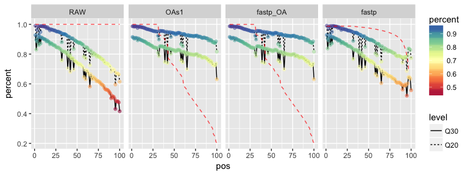
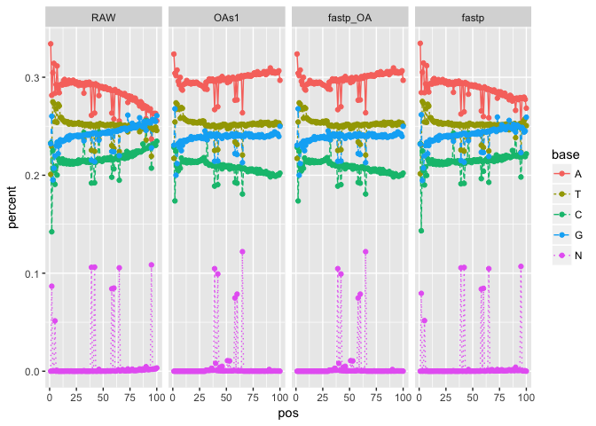

### Preparation

Tools used: `OAsa` (perl) and `fastp` (c++)

The filter process was set the same by:

common:

-   minimum length= 30bp

OA for OAs1 and fastp OA mode:

-   seed Phed Q = 10

> (which means the seed achieve 90% probability to be totally correct.)

-   fragment Phed Q = 7

> (which means the fragment after trimed should achieve 80% probability
> to be totally correct.)

-   seed length = 30 bp

> ps: 1 lowest base was tolerented for fragmnet (mostly it would be N;
> so in other words, the process will ignore no more than 1 N base.)

for fastp trim mode:

-   cut\_mean\_quality = 20

-   cut by 5' and 3' enabled

the detail are recorded in `Snakemake` configure file.

#### Table 1. The comparison of operating efficiency for filter process

| trimmer  | s       | h:m:s    | max_rss | max_vms | max_uss | max_pss | io_in | io_out | mean_load |
| -------- | ------- | -------- | ------- | ------- | ------- | ------- | ----- | ------ | --------- |
| OMG_oa   | 69.5752 | 00:01:09 | 10.77   | 459.2   | 4.68    | 5.83    | 0.01  | 20.83  | 66.52     |
| fastp_oa | 18.5106 | 00:00:18 | 489.6   | 822.07  | 488.06  | 488.11  | 8.41  | 28     | 112.08    |
| fastp    | 25.2554 | 00:00:25 | 498.82  | 822.07  | 497.27  | 497.35  | 54.69 | 37     | 117.75    |

初步来看，效率上 fastp 的OA模式相比perl 脚本要快**3倍**以上。且在fastp
中，OA模式也比分别过滤并trim要快。

#### Figure 1 Quality distribution before and after filter

过滤后的OA方法对整体质量值的提升明显。红色虚线表示过滤后该位置的碱基剩余率。

#### Figure 2 GC% distribution before and after filter

部分特定碱基位置存在大量的异常低质量比例

-   因为只取了真实数据的头500k reads，存在共聚特征。

-   随后考虑对完整的序列文件进行测试。
