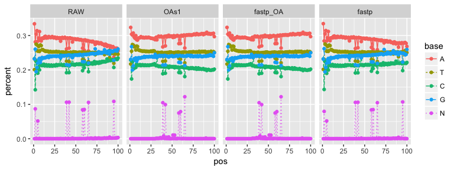

### Preparation

Tools used: `OAsa` (perl) and `fastp` (c++)

The filter process was set the same by:

common:

-   minimum length= 30bp

OA for OAs1 and fastp OA mode:

-   seed Phed Q = 10

> (which means the seed achieve 90% probability to be totally correct.)

-   fragment Phed Q = 7

> (which means the fragment after trimed should achieve 80% probability
> to be totally correct.)

-   seed length = 30 bp

> ps: 1 lowest base was tolerented for fragmnet (mostly it would be N;
> so in other words, the process will ignore no more than 1 N base.)

for fastp trim mode:

-   cut\_mean\_quality = 20

-   cut by 5' and 3' enabled

the detail are recorded in `Snakemake` configure file.

过滤后的OA方法对整体质量值的提升明显。红色虚线表示过滤后该位置的碱基剩余率。

部分特定碱基位置存在大量的异常低质量比例

-   因为只取了真实数据的头500k reads，存在共聚特征。

-   随后考虑对完整的序列文件进行测试。
